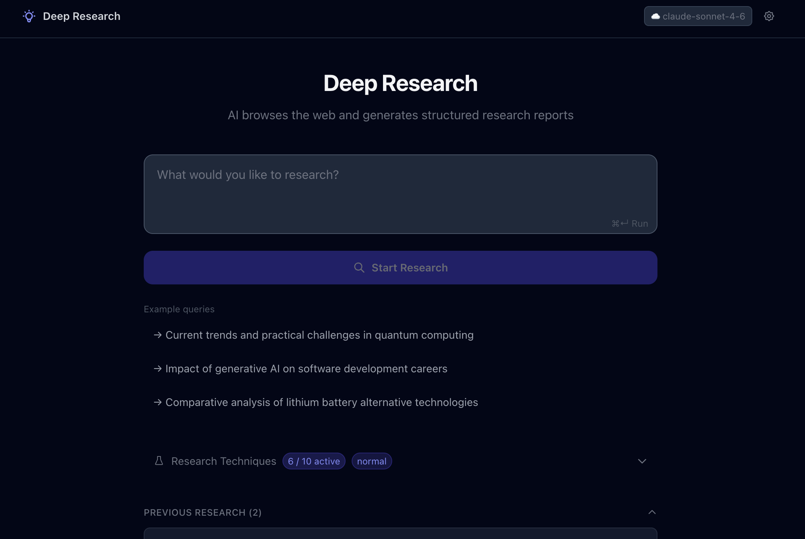
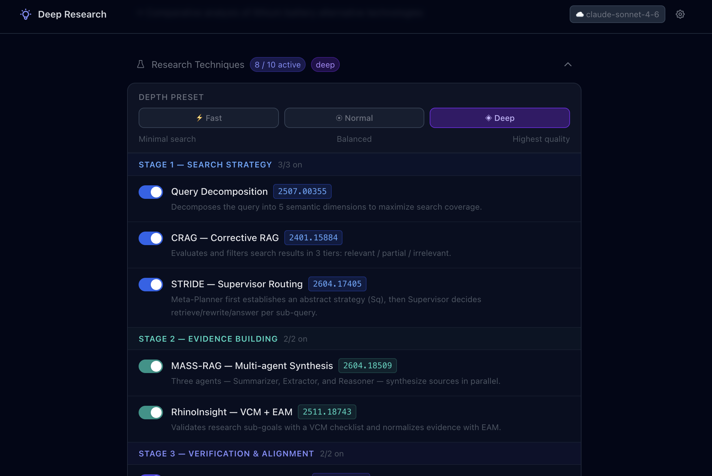
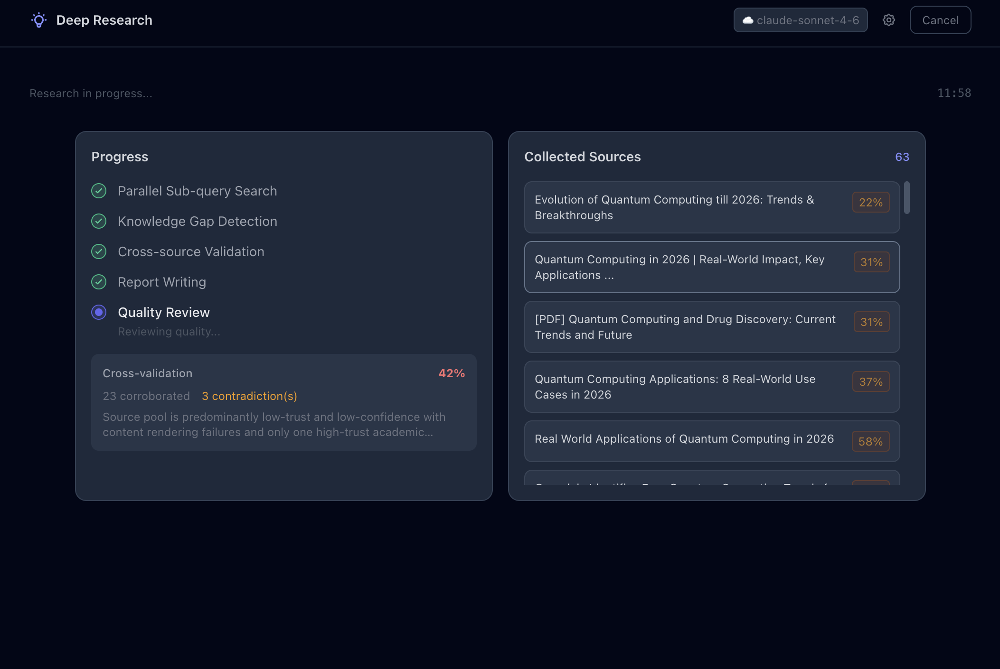
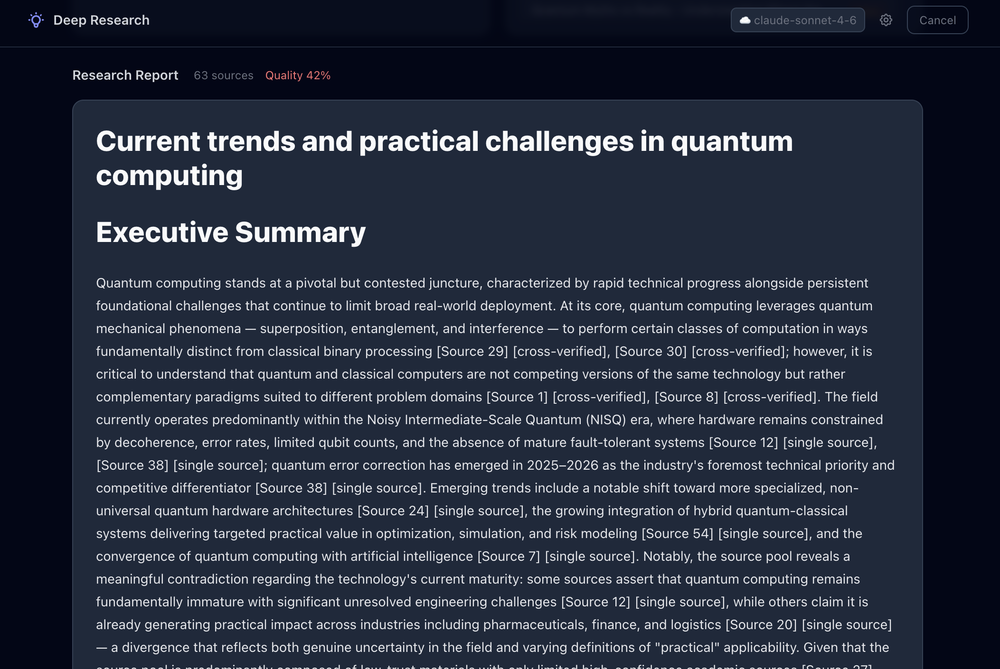
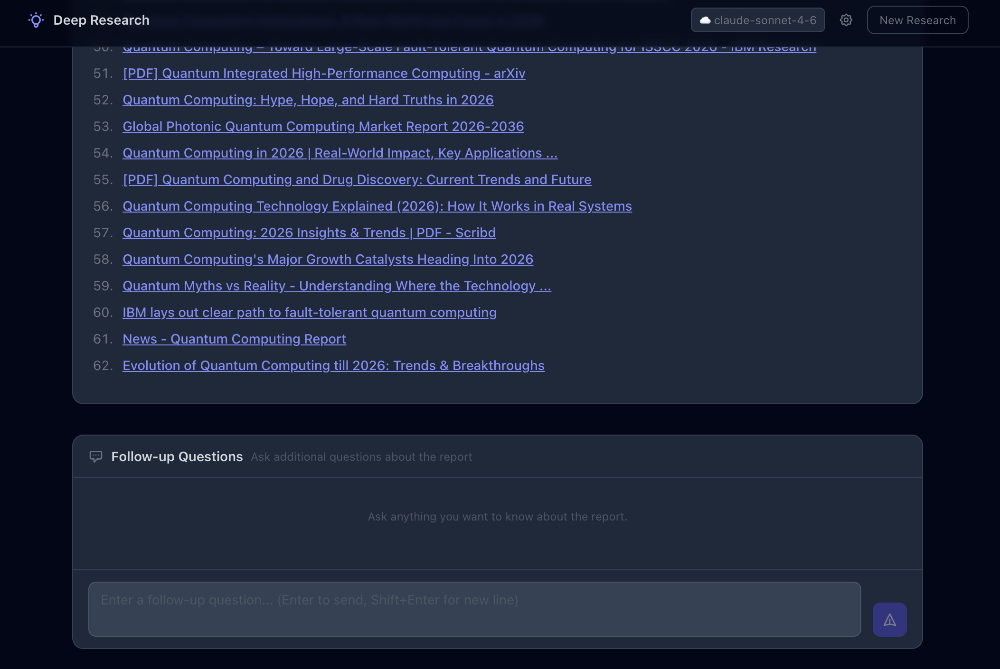
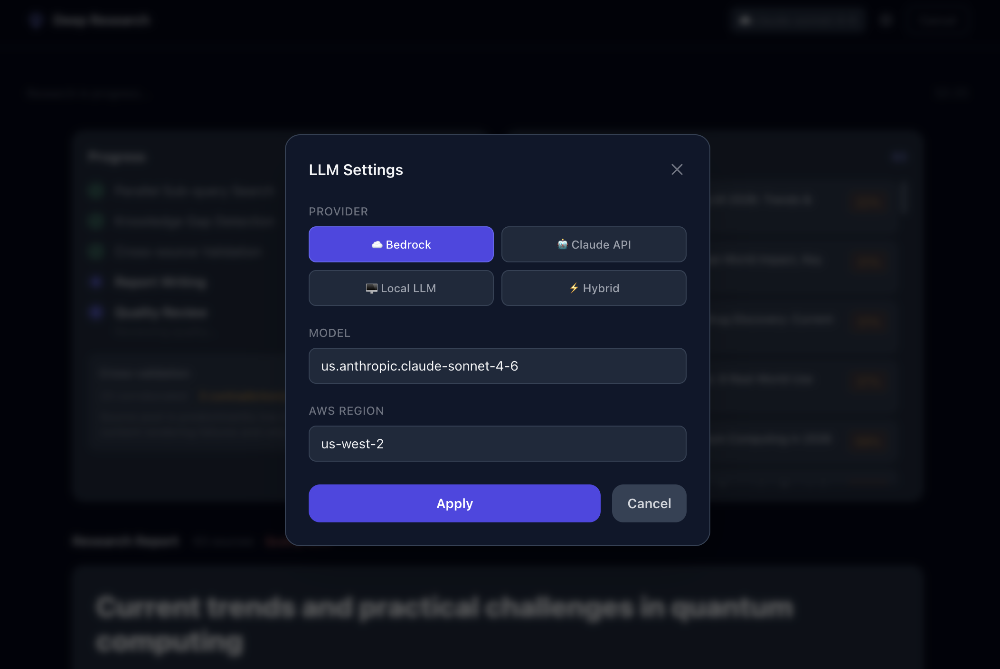

# UI Guide

The frontend is a Next.js 14 application that provides a complete research workflow in the browser. This document walks through every panel and control available at `http://localhost:3000`.

---

## Workflow Overview

```
Query input → Plan review → [Research running] → Report → Follow-up chat
```

Each step is gated: the next step only becomes available after the current one completes or is approved.

---

## 1. Query Input



Enter a research question in the text box and press **Start Research**.

- Any natural language question works.
- The backend generates a structured research plan (intent classification + sub-query decomposition) before searching.
- The LLM provider currently in use is shown as a badge next to the input (e.g. `bedrock · us.anthropic.claude-sonnet-4-6`).

---

## 2. Plan Review

Before any search begins, the system presents its research plan for your approval.

### Sub-queries
The plan lists the sub-queries that will be searched in parallel. Each sub-query can be edited inline — click the pencil icon next to any sub-query to modify it, then confirm or cancel.

### Research Depth
Controls how many sources Tavily fetches per sub-query.

| Option | Sources per sub-query |
|--------|-----------------------|
| Fast | 3 |
| Normal | 5 |
| Deep | 8 |

### Report Length
Controls how many LLM calls the writer node makes.

| Option | LLM calls | Approximate output |
|--------|-----------|--------------------|
| Brief | 1 | ~500 chars |
| Standard | 3 | ~3,000 chars |
| Detailed | 3 + N (one per sub-query) | 15,000+ chars |

### Technique Toggles



Below the plan, the **Techniques** panel shows all 9 implemented RAG techniques grouped into four stages. Each technique can be toggled on or off before approving.

| Stage | Techniques |
|-------|-----------|
| Search Strategy | Query Decomposition, CRAG, STRIDE |
| Evidence Building | MASS-RAG, Speculative RAG, RhinoInsight VCM |
| Verification & Alignment | AlignRAG, RhinoInsight EAM |
| Quality Enhancement | CONSTRUCT, DSAP |

Toggling a technique changes the `feature_flags` sent to the backend. Nodes that correspond to a disabled technique are bypassed in the LangGraph pipeline.

Click **Start Research** to approve, or **Cancel** to return to the query input.

---

## 3. Live Progress



Once approved, the research pipeline runs and streams progress events in real time.

| Event | What it means |
|-------|---------------|
| Sources found | A search worker completed one sub-query; sources are listed as they arrive |
| Gap detected | The gap detector identified missing coverage; additional queries are shown |
| Cross-validation | Source pool quality score (0–1) and contradiction count |
| Writing report | The writer node has started; report will stream when done |

An elapsed timer runs during the streaming phase. The number of sources collected is shown in the progress panel.

---

## 4. Report View



When synthesis completes, the report streams into the report panel as Markdown, rendered in real time.

- **Citations** are shown inline as `[Source N]` links.
- The full source list (URL, trust level, confidence score) is available below the report.
- Click **New Research** to return to the query input and start a new session.

---

## 5. Follow-up Chat



After the report is complete, a chat input appears at the bottom of the page.

The system automatically routes each message to one of two paths:

| Route | When used |
|-------|-----------|
| **Memory recall** | The answer is available in the existing report and citations |
| **Targeted re-search** | The question requires new information not in the current session |

When a targeted search is triggered, new sources are fetched and displayed before the answer is generated.

---

## 6. Session History

The left sidebar lists all previously completed research sessions (persisted to `data/sessions.json`).

- Click any session to restore its report and citations.
- Restored sessions re-enable the chat panel so you can continue the conversation.
- Sessions survive server restarts.

---

## 7. Local File Search

Click the **Local File Search** section at the bottom of the sidebar to index a local directory.

1. Enter the absolute path to the directory (e.g. `/Users/you/documents/papers`).
2. Toggle **Include subdirectories** as needed.
3. Click **Index**. The backend chunks the files and stores embeddings in `data/qdrant/`.

Once indexed, the pipeline retrieves from local files alongside web results. Raw file content never leaves the machine — only LLM-generated abstractions are sent to the cloud when using hybrid mode.

To remove the index, click **Delete Index**.

---

## 8. Privacy Mode

Privacy Mode is a toggle in the **Settings** section at the bottom of the Techniques panel.

When enabled, it prevents raw local file content from being sent to any cloud LLM (Bedrock or Claude API).

### How it works

Without Privacy Mode, excerpts from locally indexed files flow directly into the cloud writer node as evidence. With Privacy Mode on, those excerpts are intercepted and replaced before reaching the cloud:

```
Without Privacy Mode:
  local file content → cloud writer LLM

With Privacy Mode:
  local file content → [local LLM: MASS-RAG summary] → cloud writer LLM
                                ↑
                     only the summary crosses the boundary
```

The local LLM (Ollama) abstracts each local source into a summary via MASS-RAG. The cloud model only sees that summary, never the raw file text.

If no MASS-RAG summary is available for a local source, the excerpt is replaced with `[local source — content redacted in privacy mode]` rather than being sent.

### Requirements

Privacy Mode only applies when **Local File Search** is active (files have been indexed). It has no effect on web search results.

**MASS-RAG must be enabled** alongside Privacy Mode. If Privacy Mode is on but MASS-RAG is off, the pipeline will raise an error rather than silently leak file content.

| Setting | Effect |
|---------|--------|
| Privacy Mode off | Local file excerpts sent to cloud LLM as-is |
| Privacy Mode on, MASS-RAG off | Error — pipeline blocked |
| Privacy Mode on, MASS-RAG on, `hybrid` provider | Local file content stays local; only MASS-RAG summaries reach the cloud |

### Limitation

Privacy Mode protects file *content*, not the query itself. The research query and sub-queries are still sent to the cloud LLM for planning and synthesis. For full local execution, use `LLM_PROVIDER=ollama`.

For a deeper explanation of the privacy boundary design, see [docs/HYBRID_STRATEGY.md](HYBRID_STRATEGY.md).

---

## 9. LLM Settings



Click the gear icon (top right) to open the settings modal. You can switch the LLM provider at runtime without restarting the server.

| Provider | Notes |
|----------|-------|
| `bedrock` | AWS Bedrock; uses inference profile ID |
| `claude` | Anthropic Claude API (direct) |
| `ollama` | Fully local; requires Ollama running at `localhost:11434` |
| `hybrid` | Local model for evaluation nodes, cloud model for synthesis |

Changes take effect immediately for new research sessions.
